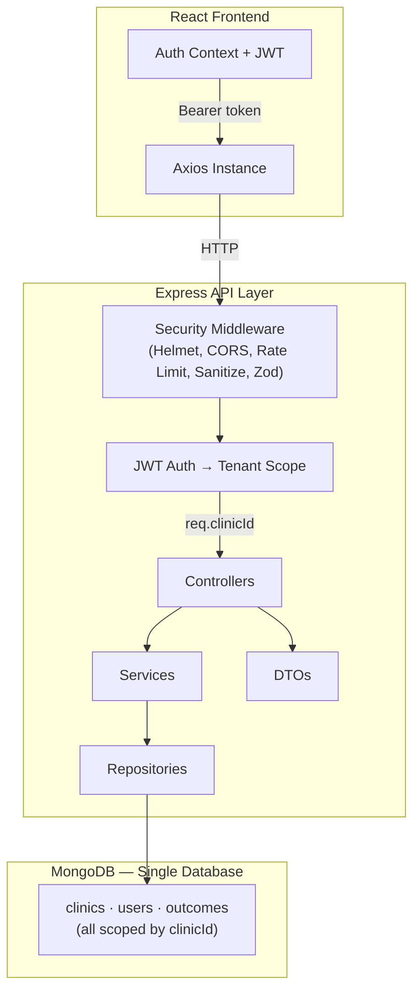
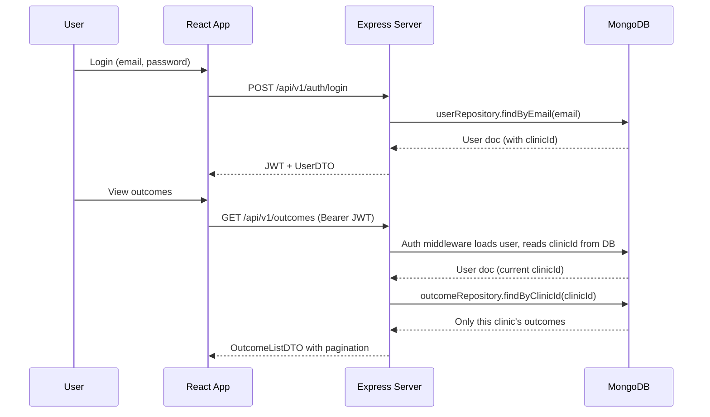
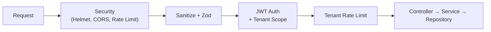

# WeHealthify — Multi-Tenant Patient Outcome Tracker

Multi-tenant architecture where multiple clinics use the same system with complete data isolation.

## Tech Stack

- **Backend:** Node.js, Express, MongoDB, Mongoose, JWT, Zod
- **Frontend:** React (Vite), Tailwind CSS, Axios, Zod
- **Monorepo:** pnpm workspaces

## Setup

### Prerequisites

- Node.js >= 18
- MongoDB (local or Atlas)
- pnpm (`corepack enable && corepack prepare pnpm@latest --activate`)

### Install & Run

```bash
git clone <your-repo-url>
cd we_healthify
cp server/.env.example server/.env
cp client/.env.example client/.env
pnpm install
pnpm seed       # creates 2 clinics, 2 users, 10 outcomes
pnpm dev        # starts backend :5050 + frontend :5173
```

For MongoDB Atlas, update `MONGO_URI` in `server/.env`.

### Test Credentials

| Clinic | Email | Password |
|--------|-------|----------|
| Downtown Physical Therapy | `admin@downtown.com` | `password123` |
| Westside Sports Medicine | `admin@westside.com` | `password123` |

## Architecture

### Layered Backend

```
Controller → Service → Repository → Model
     ↓           ↓
   DTO        Zod Schema
```

Repositories isolate all database queries — swapping MongoDB for PostgreSQL requires only repository-level changes, with services and controllers untouched.

### System Architecture



### Request Flow — Tenant Isolation



### Security Middleware Stack



### Multi-Tenant Isolation

- Shared database with `clinicId` discriminator on all tenant-scoped collections
- Auth middleware reads `clinicId` from the **user record** (not JWT) on every request — clinic reassignment takes effect immediately
- All repository methods require `clinicId` as a mandatory parameter
- Per-tenant rate limiting (100 req/min per clinic)
- Email uniqueness scoped per tenant via compound index `{ clinicId, email }`
- Compound indexes: `{ clinicId, dateRecorded }`, `{ clinicId, patientName }`, `{ clinicId, createdAt }`

## API Endpoints

| Method | Endpoint | Auth | Description |
|--------|----------|------|-------------|
| POST | `/api/v1/auth/login` | No | Authenticate, returns JWT + UserDTO |
| GET | `/api/v1/auth/me` | Yes | Current user profile |
| GET | `/api/v1/outcomes?page=1&limit=20` | Yes | List outcomes (tenant-scoped, paginated) |
| POST | `/api/v1/outcomes` | Yes | Create outcome (tenant-scoped) |
| GET | `/api/v1/outcomes/stats` | Yes | Clinic-wide aggregate stats |

## Project Structure

```
server/src/
├── config/          — env, DB connection
├── middleware/       — auth, validation, rate limiting, sanitize, request ID, logger, errors
├── models/          — Clinic, User, Outcome
├── repositories/    — data access (DB queries isolated)
├── services/        — business logic
├── controllers/     — HTTP handlers
├── dto/             — response contracts
├── schemas/         — Zod input validation
├── routes/          — versioned routes (/api/v1/)
├── utils/           — ApiError, ApiResponse, asyncHandler
└── seed.js          — seeder

client/src/
├── api/             — axios instance, API modules
├── config/          — env config
├── schemas/         — Zod validation (mirrors backend)
├── context/         — AuthContext
├── hooks/           — useForm, useDebounce
├── components/      — Navbar, OutcomeForm, OutcomeList, StatsCards, ProtectedRoute
└── pages/           — LoginPage, DashboardPage
```

## Production & Future Enhancements

**Database isolation:** Migrate to database-per-tenant for HIPAA/SOC2 physical isolation — the middleware interface (`req.clinicId`) stays identical, only the connection resolver changes.

**Microservices:** Current modular monolith splits cleanly — extract auth and outcomes into independent services behind an API gateway, with shared Zod schemas as an npm package.

**Message queues (BullMQ / Kafka):** Background processing for analytics aggregation, notifications, data exports, and audit log ingestion.

**Infrastructure:** Redis (shared rate limiting, token blacklist, caching), Node.js clustering/PM2, cursor-based pagination, distributed tracing (OpenTelemetry), audit logging, feature flags, tenant quotas.
