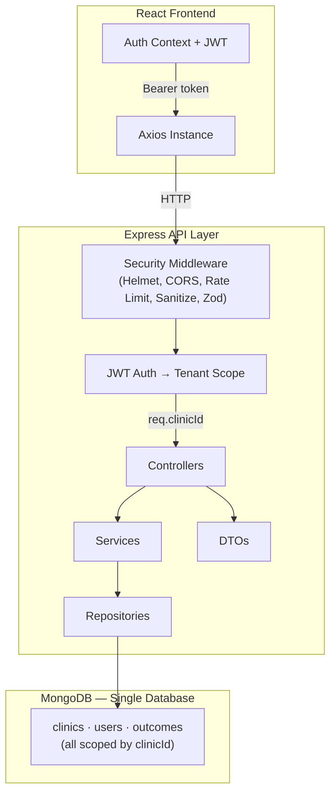
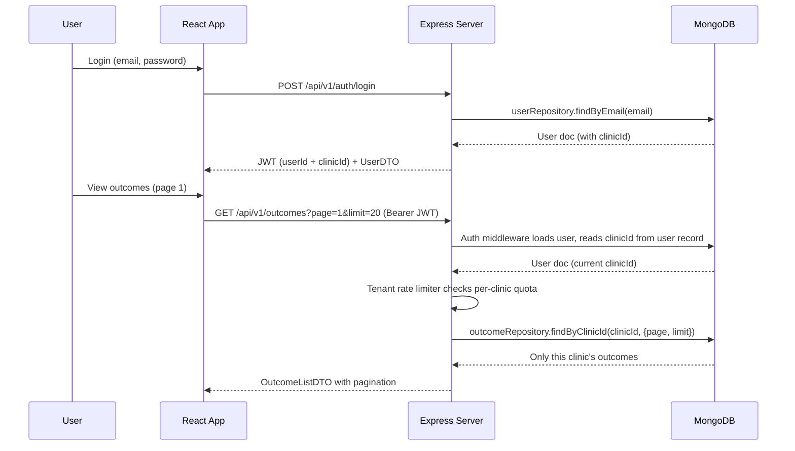
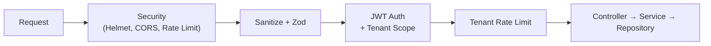

# WeHealthify — Multi-Tenant Patient Outcome Tracker

A full-stack application demonstrating multi-tenant architecture where multiple clinics use the same system with complete data isolation.

## Tech Stack

- **Backend:** Node.js, Express, MongoDB, Mongoose, JWT, Zod
- **Frontend:** React (Vite), Tailwind CSS, Axios, Zod
- **Package Manager:** pnpm (workspace monorepo)

## Quick Start

### Prerequisites

- Node.js >= 18
- MongoDB running locally (or MongoDB Atlas)
- pnpm (`corepack enable && corepack prepare pnpm@latest --activate`)

### 1. Clone and install

```bash
git clone <your-repo-url>
cd we_healthify
pnpm install
```

### 2. Configure environment

Copy the example and edit if needed:

```bash
cp server/.env.example server/.env
cp client/.env.example client/.env
```

Default `.env` values work with a local MongoDB instance:

**Backend (`server/.env`):**
```
MONGO_URI=mongodb://localhost:27017/we_healthify
PORT=5050
JWT_SECRET=we_healthify_super_secret_key_change_in_production
CLIENT_URL=http://localhost:5173
```

**Frontend (`client/.env`):**
```
VITE_PORT=5173
VITE_API_BASE_URL=/api
VITE_API_PROXY_TARGET=http://localhost:5050
VITE_TOKEN_KEY=token
VITE_APP_NAME=WeHealthify
```

For MongoDB Atlas, replace `MONGO_URI` with your connection string.

### 3. Seed the database

```bash
pnpm seed
```

This creates 2 clinics, 2 users, and 10 sample outcomes (5 per clinic).

### 4. Start the application

```bash
pnpm dev
```

- Backend: http://localhost:5050
- Frontend: http://localhost:5173

## Test Credentials

| Clinic | Email | Password |
|--------|-------|----------|
| Downtown Physical Therapy | `admin@downtown.com` | `password123` |
| Westside Sports Medicine | `admin@westside.com` | `password123` |

Login with one clinic, observe the outcomes. Logout, login with the other — you will see completely different data.

## Architecture

### Layered Architecture

```
Controller → Service → Repository → Model
     ↓           ↓
   DTO        Zod Schema
```

Each layer has a single responsibility:

| Layer | Responsibility | Example |
|-------|---------------|---------|
| **Controller** | HTTP handling, request/response shaping | `outcome.controller.js` |
| **Service** | Business logic, orchestration | `outcome.service.js` |
| **Repository** | Database queries, data access abstraction | `outcome.repository.js` |
| **Model** | Schema definition, Mongoose hooks | `Outcome.model.js` |
| **DTO** | API response contracts, hides DB schema | `outcome.dto.js` |
| **Schema** | Input validation (Zod) | `outcome.schema.js` |

**Why the repository layer matters:**
- Database logic is isolated — switching from MongoDB to PostgreSQL requires only repository changes
- Services become pure business logic, easily unit-testable with mocked repositories
- Query logic is centralized — no scattered `.find()` calls across services

**Why DTOs matter:**
- API consumers get a stable contract (`id`, not `_id`; `clinic`, not `clinicId.name`)
- Internal schema changes don't break frontend
- Enables API versioning — v2 can return different DTOs using the same services

### Multi-Tenant Architecture

#### Approach: Shared Database with Tenant Discriminator

Every document that contains tenant-specific data includes a `clinicId` field. The auth middleware reads the user's current `clinicId` from the database on every request (not from the JWT), so changes to a user's clinic assignment take effect immediately without waiting for token expiry.

#### System Architecture



#### Request Flow — Tenant Isolation



#### Security Middleware Stack



#### How isolation works

1. **Login** — user authenticates; the JWT identifies the user
2. **Auth middleware** — on every protected request, the middleware verifies the JWT, loads the user from the database, and reads `clinicId` from the **user record** (not the JWT). This means if a user's clinic changes or they're deactivated, the change takes effect on the next request
3. **Tenant rate limiter** — per-clinic rate limiting prevents one tenant from exhausting resources for others
4. **Repository layer** — all queries use `clinicId` as a mandatory filter (`outcomeRepository.findByClinicId(clinicId)`)
5. **DTO layer** — responses are shaped through DTOs that hide internal schema (`_id` → `id`, `clinicId.name` → `clinic`)
6. **Result** — a user from Clinic A cannot retrieve or modify Clinic B's data. The clinicId is derived server-side from the user record, not from any client-supplied parameter

**Enforcement model:** Tenant scoping is centralized in the auth middleware, which sets `req.clinicId`. All current repository methods require `clinicId` as a parameter. However, this is a convention enforced by code review — a developer could still write a repository method that omits the filter. In a production system, this would be hardened with a Mongoose query plugin that auto-injects `clinicId` on every query, or by using database-per-tenant where the connection itself is scoped

### User Identity

Email uniqueness is **scoped per tenant** — the compound unique index `{ clinicId, email }` allows the same email address to exist in different clinics. This is a deliberate design choice for multi-tenant SaaS where a practitioner might have accounts at multiple clinics. Login uses email alone (globally unique within the seed data), but the schema supports per-tenant identity if tenant context is added to the login flow.

### Index Strategy

Multi-tenant apps require careful indexing since every query is scoped by `clinicId`:

```javascript
outcomeSchema.index({ clinicId: 1, dateRecorded: -1 });  // List outcomes sorted by date
outcomeSchema.index({ clinicId: 1, patientName: 1 });     // Patient lookup within clinic
outcomeSchema.index({ clinicId: 1, createdAt: -1 });      // Audit trail ordering
```

All queries hit the compound index first, ensuring tenant-scoped reads are O(log n) regardless of total dataset size.

### API Versioning

Routes are mounted under both `/api/v1/` (versioned) and `/api/` (backward-compatible):

```
/api/v1/auth/login    — versioned endpoint
/api/auth/login       — backward-compatible alias
```

This allows introducing `/api/v2/` in the future without breaking existing clients.

### Request Tracing

Every request is assigned a unique `x-request-id` (either from the incoming header or auto-generated UUID). This ID:
- Appears in structured JSON logs alongside `tenantId`, `userId`, `method`, `url`, `status`, and `responseTime`
- Is included in error responses for debugging
- Can be passed to downstream services in a microservices setup for distributed tracing

### Why this approach

- **Simplicity** — single database, single connection pool, straightforward deployment
- **Enforceability** — tenant scoping is centralized in one middleware; all repositories accept `clinicId` as a required parameter. Convention-based, hardened in production via query plugins or database-per-tenant
- **Scalability** — compound indexes on `{ clinicId, dateRecorded }` keep tenant-scoped queries efficient regardless of total data volume
- **Migration path** — the middleware interface is identical whether you use a discriminator column or database-per-tenant. Switching strategies requires changing only the connection resolver, not business logic

### Production Suitability

The shared-database approach is production-viable and widely used by SaaS platforms (Salesforce, Shopify, Atlassian) at massive scale. It works well when:
- Tenants share the same schema and feature set
- Operational simplicity is valued (single backup, single migration, single connection pool)
- Logical isolation via middleware is sufficient for compliance

## Scaling Paths

### Database-per-Tenant

When regulatory requirements demand physical data isolation (HIPAA, SOC2), the architecture evolves to database-per-tenant without rewriting business logic:
- The `auth.middleware.js` interface stays identical — it still sets `req.clinicId`
- A **connection resolver** maps `clinicId` to a dedicated MongoDB database at the middleware layer
- Repositories and services remain unchanged — they never know which database they're hitting
- Trade-off: adds connection pool management, cross-database migration tooling, and per-tenant backup strategies

### Modular Monolith to Microservices

This application uses a **modular monolith** — a single deployable unit with clear internal boundaries (routes → controllers → services → repositories → models per domain). This is the recommended starting point because:
- It avoids premature distributed-system complexity
- Each module (auth, outcomes) has its own service layer with no cross-dependencies
- The folder structure mirrors how services would be split

When scale demands it, the migration path is straightforward:

**Step 1: Service Extraction**
- **Auth service** — extract `auth.routes`, `auth.controller`, `auth.service`, `user.repository`, `User.model` into a standalone service
- **Outcomes service** — extract outcome-related modules; communicates with auth via JWT validation (already stateless)

**Step 2: Infrastructure**
- **API Gateway** — routes `/api/v1/auth/*` to the auth service and `/api/v1/outcomes/*` to the outcomes service
- **Shared packages** — Zod schemas, DTOs, middleware utilities become a shared npm package

**Step 3: Async Communication**
- **Message queues (BullMQ / RabbitMQ / Kafka)** — for tasks that don't need synchronous responses:
  - Analytics aggregation (compute clinic-level stats in background)
  - Notification delivery (email/SMS on threshold triggers)
  - Data export jobs (CSV/PDF reports)
  - Audit log ingestion
- **Event-driven patterns** — outcomes service emits `outcome.created` events; analytics and notification services consume independently

The key insight: the current layered architecture (controller → service → repository) with clear module boundaries makes this extraction mechanical, not architectural.

### Dependency Injection

Currently, modules import dependencies directly (e.g., `outcomeService` imports `outcomeRepository`). For larger systems, a DI container (Awilix, InversifyJS, TSyringe) provides:
- Automatic dependency resolution
- Easy swap of implementations (e.g., mock repository for testing)
- Lifecycle management (singleton, transient, scoped-per-request)

The current import-based approach is equivalent to "poor man's DI" — each service receives its repository via import, and swapping requires only changing the import path. DI containers become valuable when the dependency graph grows beyond ~20 services.

### Feature Flags & Tenant Quotas

Production SaaS systems introduce per-tenant configuration:

**Feature flags** (via LaunchDarkly, Unleash, or a config table):
- Enable beta features per clinic
- A/B testing of new UI flows
- Gradual rollouts without redeployment

**Tenant quotas:**
- Max outcomes per month per clinic (billing tiers)
- Max users per clinic
- Rate limit overrides per pricing plan

These are stored in the `clinics` collection and checked at the middleware/service layer.

### Audit Logging

Healthcare systems require immutable audit trails:
- **Who** accessed or modified patient data (userId, clinicId)
- **What** action was performed (create, read, update, delete)
- **When** it happened (timestamp with timezone)
- **Request context** (requestId for correlation)

Implementation: an `AuditLog` model written on every mutation, or an event-driven approach where services emit audit events consumed by a dedicated logging service.

## Project Structure

```
we_healthify/
├── server/
│   └── src/
│       ├── config/            — env config, DB connection
│       ├── middleware/         — auth, validation, rate limiting, sanitization,
│       │                        request ID, request logger, error handling
│       ├── models/            — Clinic, User, Outcome (Mongoose schemas)
│       ├── repositories/      — data access layer (DB queries isolated)
│       ├── services/          — business logic (tenant-scoped operations)
│       ├── controllers/       — HTTP request handlers
│       ├── dto/               — response shaping (API contracts)
│       ├── schemas/           — Zod input validation schemas
│       ├── routes/            — route definitions (versioned: /api/v1/)
│       ├── utils/             — ApiError, ApiResponse, asyncHandler
│       ├── seed.js            — database seeder
│       ├── app.js             — Express app setup (middleware stack)
│       └── server.js          — entry point
├── client/
│   └── src/
│       ├── api/               — axios instance, API modules
│       ├── config/            — centralized env config
│       ├── schemas/           — Zod validation (mirrors backend)
│       ├── context/           — AuthContext (login/logout state)
│       ├── hooks/             — useForm (Zod-integrated), useDebounce
│       ├── components/        — Navbar, OutcomeForm, OutcomeList, StatsCards, ProtectedRoute
│       ├── pages/             — LoginPage, DashboardPage
│       └── App.jsx            — routing with lazy loading
└── package.json               — workspace root (pnpm monorepo)
```

## API Endpoints

| Method | Endpoint | Auth | Description |
|--------|----------|------|-------------|
| POST | `/api/v1/auth/login` | No | Authenticate user, returns JWT + UserDTO |
| GET | `/api/v1/auth/me` | Yes | Get current user profile (UserDTO) |
| GET | `/api/v1/outcomes?page=1&limit=20` | Yes | List outcomes with pagination (scoped to user's clinic) |
| POST | `/api/v1/outcomes` | Yes | Create outcome (scoped to user's clinic) |
| GET | `/api/v1/outcomes/stats` | Yes | Clinic-wide aggregate stats (total, unique patients, averages) |

Unversioned aliases (`/api/auth/*`, `/api/outcomes/*`) are also available for backward compatibility.

## Security Measures

**Implemented:**
- Helmet (secure HTTP headers)
- CORS origin whitelist
- Rate limiting — global: 100 req/15min, login: 10 req/15min, per-tenant: 100 req/min
- Input sanitization (HTML/script tag stripping)
- Zod schema validation on all mutating endpoints (frontend + backend)
- JWT authentication with tenant scoping
- Body size limit (16kb) to prevent large-payload DoS
- Password hashing with bcrypt
- Request ID tracing (`x-request-id`)
- Structured request logging with tenant context

## Production Considerations

The following enhancements would be added when scaling for production:

**Infrastructure:**
- **Redis** — shared rate limiting state across horizontally scaled instances, token blacklist for logout, caching frequently accessed tenant data
- **Node.js clustering / PM2** — multi-core utilization (Node is single-threaded by default)
- **API Gateway** — centralized routing, rate limiting, and auth when splitting into microservices
- **HTTPS + CSP** — TLS termination at reverse proxy (Nginx/Cloudflare), Content Security Policy headers

**Data:**
- **Database-per-tenant** — physical isolation for HIPAA/SOC2 (see scaling path above)
- **Cursor-based pagination** — offset pagination degrades on large datasets; cursor-based stays O(1)
- **Audit logging** — immutable log of who accessed/modified patient data, required for healthcare compliance
- **Background jobs (BullMQ/Kafka)** — async processing for analytics, notifications, exports

**Observability:**
- **Distributed tracing** — propagate `x-request-id` across services (OpenTelemetry, Jaeger)
- **Structured logging** — JSON logs with tenant context for monitoring dashboards (already implemented at basic level)
- **Health checks + readiness probes** — for container orchestration (Kubernetes/ECS)

**SaaS Features:**
- **Feature flags** — per-tenant feature toggles (LaunchDarkly, Unleash)
- **Tenant quotas** — billing-tier limits (max outcomes/month, max users/clinic)
- **Dependency injection** — DI container (Awilix) for large-scale service graphs
